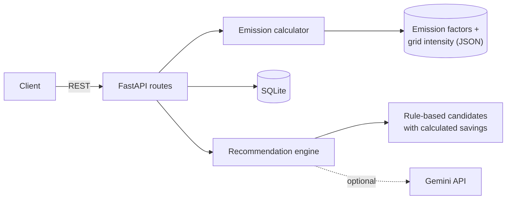

# EcoPulse: AI Carbon Footprint Assistant

[](https://github.com/swetasaraswat/EcoPulse/actions/workflows/tests.yml)


EcoPulse is a Python backend that logs a person's daily activities (travel, electricity, cooking gas, meals, waste), estimates the CO2-equivalent of each one using carbon intensity data for where they live, and suggests habit changes based on their recent history.

Most footprint calculators use one global number for electricity. Here, a kWh in India, the UK or Brazil is not treated the same, because the grids are very different. And when the AI suggests a habit change, the saving it quotes is calculated from the data model, not made up by the language model.

## What it does

- **Ingests daily activities** through a REST API: car, bus, metro, train, flights, home electricity, LPG, meals, waste.
- **Estimates CO2e with localised data.** Electricity-based activities (home power, EVs, trains) use the grid intensity of the user's region. India uses the CEA figure.
- **Tracks the footprint** as a daily total by category and a day-by-day history.
- **Recommends habit changes.** Rules find realistic swaps in what the user actually logged and calculate the savings. Optionally, Gemini picks the best ones and words them in a friendlier way. Without an API key, or if the AI step fails, it falls back to rule-based wording and the endpoint still works.

## Quick start

You need Python 3.10 or newer.

```bash
git clone https://github.com/swetasaraswat/EcoPulse.git
cd EcoPulse
python -m venv .venv
source .venv/bin/activate          # Windows: .venv\Scripts\activate
pip install -e ".[dev]"

python scripts/seed_demo.py        # optional: a demo user with a week of made-up activity
uvicorn ecopulse.main:create_app --factory --reload
```

Open http://127.0.0.1:8000/docs for the interactive API docs.

## Try it

Create a user, log a day, and look at the result:

```bash
curl -X PUT  localhost:8000/users/sweta -H "content-type: application/json" -d '{"region": "IN"}'

curl -X POST localhost:8000/users/sweta/activities -H "content-type: application/json" \
  -d '{"activities": [
        {"activity_type": "car_petrol", "quantity": 12},
        {"activity_type": "electricity_home", "quantity": 8},
        {"activity_type": "meal_chicken", "quantity": 1}]}'

curl localhost:8000/users/sweta/footprint
curl localhost:8000/users/sweta/recommendations
```

That day works out like this for a user in India:

| Activity | Amount | kg CO2e |
|---|---|---|
| Petrol car | 12 km | 1.98 |
| Home electricity | 8 kWh | 5.82 |
| Chicken meal | 1 meal | 1.70 |
| **Total** | | **9.50** |

The same 8 kWh in the UK would be 1.90 kg, because the UK grid is much cleaner. `POST /estimate` lets you compare regions without saving anything.

### Recommendations

This is real output for the demo user (`python scripts/seed_demo.py`), running without a Gemini key:

```json
{
    "source": "rules",
    "fallback_reason": "GEMINI_API_KEY is not set",
    "summary": "Over the last 7 days you averaged 15.5 kg CO2e a day, mostly from home energy. The last few days were higher than the days before.",
    "suggestions": [
        {
            "candidate_id": "electricity_cut",
            "title": "Trim home electricity by about 10 percent",
            "message": "Use about 6.9 kWh less a week: AC at 24 to 26 degrees, switch off standby devices, LED bulbs. That could save about 5.02 kg CO2e a week.",
            "category": "energy",
            "weekly_saving_kg_co2e": 5.02
        },
        {
            "candidate_id": "beef_to_vegetarian",
            "title": "Swap some beef meals",
            "message": "Swap 1 of your beef or buffalo meals a week for a vegetarian option like dal, rajma or paneer. That could save about 4.6 kg CO2e a week.",
            "category": "food",
            "weekly_saving_kg_co2e": 4.6
        }
    ]
}
```

(Trimmed to two suggestions here. The full response is in [`examples/sample_recommendations.json`](examples/sample_recommendations.json).) With a key set, `source` becomes `"gemini"` and the wording is written by the model, while `weekly_saving_kg_co2e` still comes from the calculation.

## API

| Method | Path | What it does |
|---|---|---|
| GET | `/health` | Status, version, and whether the AI step is enabled |
| GET | `/factors` | Every supported activity with its factor, source and confidence |
| GET | `/regions` | Grid carbon intensity by region |
| POST | `/estimate` | Estimate emissions for a list of activities without saving |
| PUT | `/users/{user_id}` | Create a user or change their region |
| GET | `/users/{user_id}` | Get a user |
| POST | `/users/{user_id}/activities` | Log activities for a day |
| GET | `/users/{user_id}/footprint?date=` | One day's total, by category, with each entry |
| GET | `/users/{user_id}/history?days=` | Daily totals for the last N days |
| GET | `/users/{user_id}/recommendations?days=&ai=` | Personalised habit suggestions |

## How it works



**Emissions.** `co2e = quantity × factor`. A factor is either a fixed number (petrol car, per km) or kWh per unit multiplied by the regional grid intensity. Region codes fall back from `IN-UP` to `IN` to a world average, and the response says when a fallback was used. Details and sources are in [docs/methodology.md](docs/methodology.md).

**Recommendations.** The engine summarises the last N days, matches them against habit-change rules in `data/swaps.json` (for example moving some car km to the bus), and calculates the weekly saving of each using the same factor model. If Gemini is configured, it receives the summary and the candidates, chooses up to three, and writes short friendly messages. The reply is validated: unknown candidate ids are dropped, and savings are always taken from the calculation. If the key is missing, the request fails, or the reply is unusable, the rule-based wording is returned instead and `fallback_reason` says why. More in [docs/architecture.md](docs/architecture.md).

## Configuration

Set these as environment variables or in a `.env` file (see `.env.example`). All are optional.

| Variable | Default | Purpose |
|---|---|---|
| `ECOPULSE_DB` | `ecopulse.db` | SQLite file location |
| `GEMINI_API_KEY` | none | Enables the AI step of the recommendation engine |
| `GEMINI_MODEL` | `gemini-2.5-flash` | Which Gemini model to call |
| `ECOPULSE_DEFAULT_REGION` | `IN` | Default region code |

## Project structure

```
EcoPulse/
├── src/ecopulse/
│   ├── main.py                  # app factory
│   ├── api.py                   # REST routes
│   ├── models.py                # request / response schemas
│   ├── storage.py               # SQLite access
│   ├── services.py              # wiring
│   ├── config.py                # settings
│   ├── emissions/
│   │   ├── factors.py           # loads factor + grid data, region fallback
│   │   └── calculator.py        # quantity × factor
│   ├── recommendations/
│   │   ├── rules.py             # candidate habit changes with savings
│   │   ├── engine.py            # summary, AI step, validation, fallback
│   │   ├── prompts.py
│   │   └── gemini_client.py     # small REST client
│   └── data/
│       ├── emission_factors.json
│       ├── grid_intensity.json
│       └── swaps.json
├── tests/
├── docs/                        # architecture and methodology
├── examples/                    # sample requests and real responses
├── scripts/seed_demo.py
├── .github/workflows/tests.yml  # CI on Python 3.10, 3.11, 3.12
├── pyproject.toml
└── requirements.txt
```

## Tests

```bash
pytest
```

The suite covers the calculator (including localisation and region fallback), storage, the recommendation engine (with a fake model, including bad and invented replies), the Gemini client (against a mocked HTTP transport), and the full API flow.

## Limitations

- **The numbers are estimates.** Emission factors are rounded and some rest on stated assumptions (portion sizes, fuel economy). Each one carries a `confidence` label, and `GET /factors` shows the source. Check them before using the output for anything official.
- Fuel factors are tailpipe only, and grid figures are for generation, so transmission losses are not included.
- Grid intensity is a yearly average, not time-of-day.
- The Gemini step is tested with a mocked HTTP layer. There is no live-API test in CI.
- There is no authentication. User ids are plain strings, so this is a demo backend, not a production service.
- SQLite is fine for one process. A multi-instance deployment would need a different database.

## Roadmap

- State-level grid intensity for India (Ember publishes sub-national data)
- Edit and delete logged activities
- Authentication
- Docker image
- A simple dashboard on top of the API
- Weekly summary export (CSV)

## License

MIT. See [LICENSE](LICENSE).
