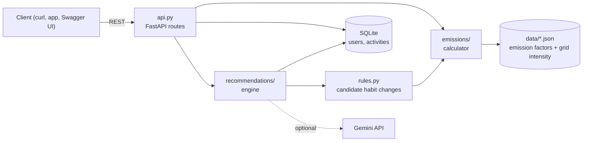
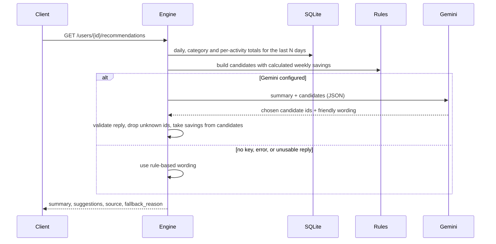

# Architecture

EcoPulse is a small FastAPI service split into layers that each do one job. Nothing in the emissions or recommendation layers knows about HTTP, so they can be tested (and reused) on their own.

## Modules

| Module | Job |
|---|---|
| `main.py` | App factory. Builds the services and mounts the routes. No work happens at import time. |
| `api.py` | HTTP layer: validation, status codes, turning results into response models. |
| `models.py` | Pydantic request and response schemas. |
| `emissions/factors.py` | Loads and validates the JSON data models. Looks up grid intensity with a fallback chain (`IN-UP` → `IN` → `GLOBAL`). |
| `emissions/calculator.py` | Turns `(activity_type, quantity, region)` into kg CO2e. |
| `storage.py` | SQLite access for users and activities. |
| `recommendations/rules.py` | Finds habit changes that match what the user logged and calculates the saving for each. |
| `recommendations/engine.py` | Builds the history summary, optionally asks the language model to pick and word the suggestions, validates the reply, and falls back to rules. |
| `recommendations/gemini_client.py` | Thin REST client for Gemini. |
| `services.py` | Wires everything together, shared by the API, tests and scripts. |
| `data/*.json` | The data models: emission factors, grid intensity, habit-change rules. |

## How a recommendation is made

## Design decisions

**The model never does the maths.** Savings are calculated from the emission factor model. The language model only chooses among candidates and rewrites them in friendlier words. The response's `weekly_saving_kg_co2e` always comes from the calculation, even if the model's text says something different. (The wording itself is written by the model, so it is not guaranteed to be free of errors.)

**The AI step is optional and can fail safely.** With no API key, a network error, a non-200 response or a reply that does not parse, the endpoint still returns useful suggestions. `source` and `fallback_reason` tell the caller what happened.

**Data lives in JSON, not code.** Emission factors, grid intensity and habit rules are plain files. Changing a number or adding a region does not need a code change, and every entry carries its source and a confidence level.

**Electricity-based factors are localised.** Activities such as home electricity, electric cars and trains store kWh per unit and multiply by the user's regional grid intensity. The same 100 kWh gives a different result in India and the UK.

**SQLite with a connection per operation.** It needs no setup and is safe under FastAPI's thread pool. Emissions are stored at log time along with the factor used, so old entries do not change when the factor data is updated later.

**App factory.** `create_app()` takes settings and an optional Gemini client, which is how the tests swap in a temporary database and a fake model.
